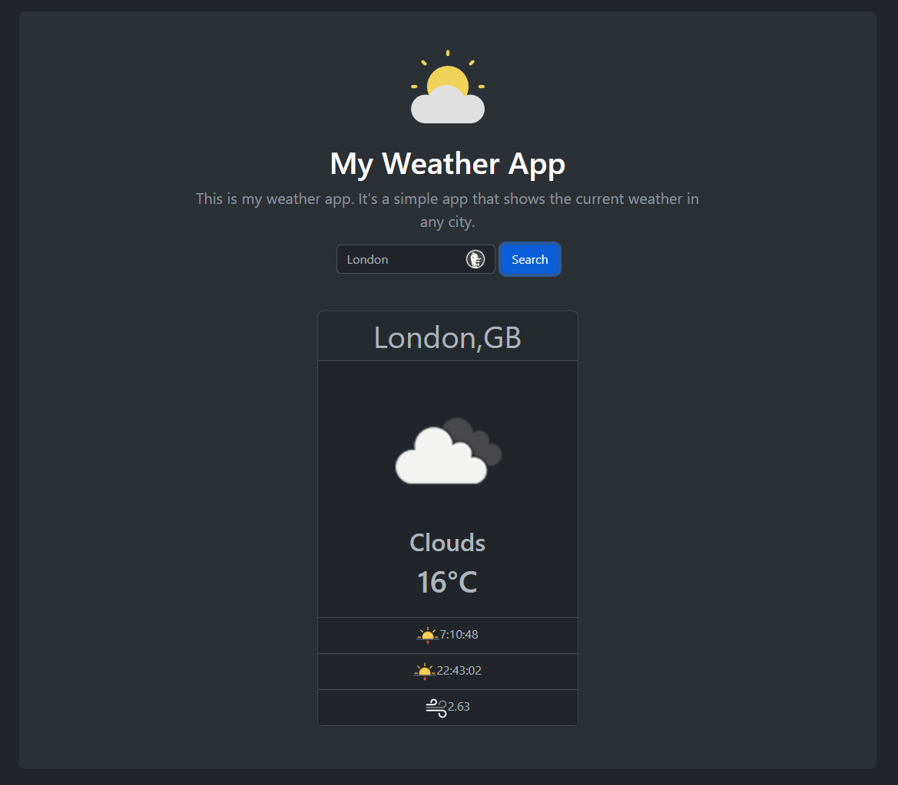

# Simple Weather app 
This project is a weather web application that utilizes the Open Weather Map API, Node.js, Express.js, Bootstrap, and jQuery. By leveraging these technologies, the app provides users with real-time weather data based on their search query. The project was a challenging and rewarding experience, as it involved working with APIs and backend technologies such as Node.js and Express.js, as well as frontend design elements like Bootstrap and jQuery. Overall, this project demonstrates my ability to work with complex technologies and deliver a functional and user-friendly application.

